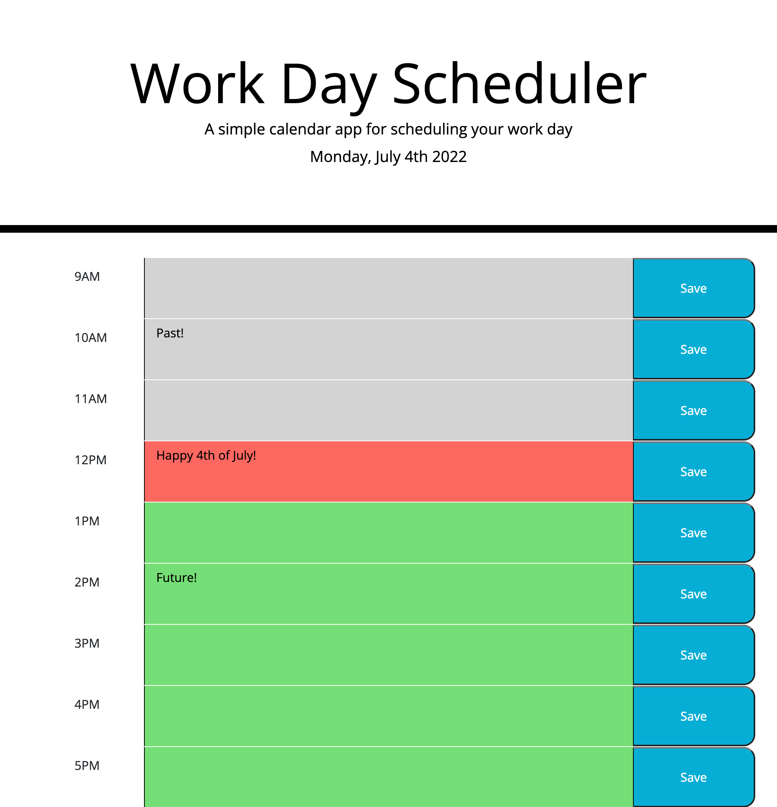

# Daily Planner

## Description
A simple calendar application that allows a user to save events for each hour of the day between 9AM-5PM. Hour blocks in the past, present, and future will change colors as time passes. 

## Built With
* HTML
* CSS
* JavaScript
* JQuery
* Bootstrap

## Application
To deploy application click [here.](https://jmotto.github.io/Daily-Planner/)

